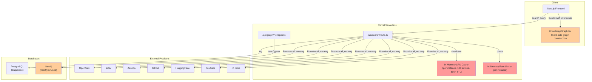
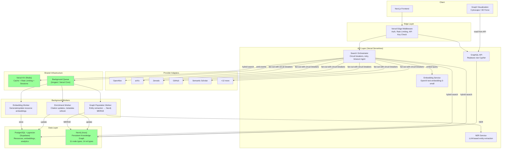

# Open Idea Platform: Resources & Knowledge Graph — Architecture Analysis and Commercial Roadmap

| Field | Value |
|-------|-------|
| **Date** | 2026-03-05 |
| **Version** | 1.0 |
| **Status** | Draft |
| **Scope** | Federated search pipeline, knowledge graph infrastructure, data models, monetization strategy |

---

## 1. Executive Summary

The Open Idea Platform currently provides a federated search capability across **10 resource providers** (OpenAlex, arXiv, Zenodo, Software Heritage, GitHub, HuggingFace, YouTube, OSHWA, Wikifactory, and a mock hardware provider), unified through a fan-out query pattern with deduplication and basic relevance scoring. A knowledge graph layer exists using Neo4j on the backend and Cytoscape.js/react-force-graph-3d on the frontend, but graph construction happens entirely client-side and is never persisted.

**Key gaps** preventing commercial viability:

- **Naive entity extraction**: Only 26 hardcoded technology keywords with regex-based person/organization detection. No NLP, no disambiguation, no coreference resolution.
- **Trivial relevance scoring**: A 3-signal binary formula (`0.5 * titleMatch + 0.3 * recency + 0.2 * licensePresence`) that produces only 8 possible score values, ignoring citation counts, download metrics, and other quality signals already present in provider metadata.
- **Ephemeral knowledge graph**: The `buildGraph` function in `KnowledgeGraph.tsx` constructs relationships (AUTHORED_BY, TAGGED, FROM, IS_TYPE) on each render; none are persisted to Neo4j. The graph API exposes raw Cypher execution, creating an injection risk.
- **No semantic search**: No vector embeddings, no query expansion, no intent classification. Search is purely keyword-based string matching.
- **No monetization infrastructure**: Despite the Prisma schema already containing `reputationScore`, `achievementBadges`, and `subscriptionPlan` fields, none are wired to application logic.
- **6 declared-but-unimplemented providers**: CKAN, PapersWithCode, GitLab, Figshare, Kaggle, and Custom are defined in the type system but have no provider implementation.

This document evaluates the current architecture in detail, proposes specific improvements for the knowledge graph, semantic search, and contributor incentive systems, identifies new resource providers for integration, outlines monetizable features with pricing tiers, and presents a phased 24-week implementation roadmap to transform the platform from a federated search tool into a commercially viable open-knowledge intelligence platform.

---

## 2. Current Architecture Evaluation

### 2.1 Federated Search Pipeline

**Source**: `app/api/search/route.ts`

#### Fan-Out Pattern

The search endpoint dispatches queries to **10 provider functions** in parallel via `Promise.all` (lines 202–224). Each provider is wrapped in an individual `try/catch` — on failure, an empty array is returned silently. There is **no retry logic**, **no circuit breaker**, and **no timeout aggregation strategy**. Each provider function internally uses an `AbortController` with an 8-second timeout, but a slow provider simply returns empty results without logging or alerting.

```typescript
// Current pattern (route.ts:215-223)
await Promise.all(
  providerFns.map(async ({ name, fn }) => {
    try {
      results[name] = await fn();
      void trackApiRequest(name, 'search');
    } catch {
      results[name] = [];
    }
  })
);
```

**Weaknesses**:
- Silent failure masks provider outages — no distinction between "provider returned 0 results" and "provider timed out"
- No circuit breaker means repeated calls to a failing provider waste time on every request
- `trackApiRequest` is fire-and-forget (`void`) — failures in tracking are invisible

#### Implemented Providers (10)

| Provider | Source File | Data Source | Timeout |
|----------|------------|-------------|---------|
| OpenAlex | `providers/openalex.ts` | Academic papers, citations | 8s |
| arXiv | `providers/arxiv.ts` | Preprints | 8s |
| Zenodo | `providers/zenodo.ts` | Research data, software | 8s |
| Software Heritage | `providers/swh.ts` | Archived source code | 8s |
| GitHub | `providers/github.ts` | Repositories | 8s |
| HuggingFace | `providers/huggingface.ts` | ML models, datasets | 8s |
| YouTube | `providers/youtube.ts` | Educational videos | 8s |
| Hardware (mock) | `providers/hardware.ts` | **Hardcoded demo data** | N/A |
| OSHWA | `providers/oshwa.ts` | Open-source hardware | 8s |
| Wikifactory | `providers/wikifactory.ts` | Design files | 8s |

**Note**: The hardware provider returns static mock data — it is not connected to any real API.

#### Declared but Unimplemented Providers (6)

Defined in `src/types/resource.ts` (`ResourceProvider` type) but with no corresponding provider function:
- `ckan` — Government open data portals
- `paperswithcode` — ML papers with code
- `gitlab` — Repository search
- `figshare` — Research data
- `kaggle` — Datasets and notebooks
- `custom` — User-defined sources

#### Normalization & Deduplication

A 4-stage pipeline processes raw provider results:

1. **Normalization** (`app/api/search/lib/normalize.ts`): DOI stripping (`https://doi.org/` prefix removal), URL normalization (trailing slash, protocol), title normalization (lowercase, whitespace collapse), author name normalization.

2. **Key derivation** (`app/api/search/lib/keys.ts`): Four key types for strong matching:
   - `doi:<normalized-doi>`
   - `swhid:<swhid>`
   - `url:<normalized-url>`
   - `srctitle:<source>:<normalized-title>`

3. **Strong-key merge**: Resources sharing any key are merged deterministically (first seen wins, metadata combined).

4. **Heuristic merge** (`app/api/search/lib/dedupe.ts`): Second pass using token-based Jaccard similarity with thresholds:
   - Title similarity ≥ 0.92
   - Author overlap required
   - Year within ±1
   - Produces a decision audit trail for debugging

#### Relevance Scoring

**Source**: `route.ts:106–112`

```typescript
function scoreResource(r: Resource, q: string): number {
  const text = (r.title + ' ' + (r.description || '')).toLowerCase();
  const match = text.includes(q.toLowerCase()) ? 1 : 0;
  const recency = r.year ? Math.max(0, (new Date().getFullYear() - r.year) < 5 ? 1 : 0) : 0;
  const quality = (r.license && r.license !== 'NOASSERTION' ? 1 : 0);
  return 0.5 * match + 0.3 * recency + 0.2 * quality;
}
```

**Critical weaknesses**:
- All three signals are **binary** (0 or 1), producing only **8 possible score values** (0.0, 0.2, 0.3, 0.5, 0.5, 0.7, 0.8, 1.0)
- `titleMatch` uses `String.includes()` — no tokenization, no term frequency, no TF-IDF or BM25
- Recency is a cliff function (< 5 years = 1, else 0) — no continuous decay
- **Ignores provider-specific quality signals** already present in `meta` fields:
  - GitHub: `stars`, `forks`, `watchers`
  - HuggingFace: `downloads`, `likes`
  - OpenAlex: `cited_by_count`
  - arXiv: category relevance
  - Zenodo: download count, version count

#### Caching

- **Type**: In-memory `Map` with LRU eviction
- **Capacity**: 100 entries
- **TTL**: 5 minutes
- **Scope**: Per serverless function instance (NOT shared across Vercel instances)
- **Implication**: On Vercel's serverless deployment (confirmed by `vercel.json` with 30s `maxDuration`), each cold start gets an empty cache. Cache hit rate is likely very low under realistic traffic patterns.

#### Pagination

Two pagination modes coexist:

1. **Offset-based**: `page` and `limit` query params for simple pagination (lines 190–234)
2. **Cursor-based**: Base64url-encoded JSON cursor containing `sessionId`, `offset`, and `limit` — backed by the same in-memory cache

**Problem**: Cursor-based pagination stores the full result set in the in-memory session cache. If a subsequent cursor request hits a different serverless instance, the session is not found and returns empty results.

#### Rate Limiting

- **Anonymous users**: 5 searches per 24-hour window, tracked via in-memory `Map` keyed by `anon_session` cookie
- **Graph query endpoint**: 30 requests/minute per IP (separate rate limiter)
- **Storage**: In-memory — same cross-instance problem as caching
- **Cleanup**: Stale entries purged when map exceeds 10,000 entries

### 2.2 Knowledge Graph Infrastructure

#### Neo4j Client

**Source**: `app/lib/graph/neo4j-client.ts`

The Neo4j integration is minimal — a singleton driver pattern with bolt protocol and `ENCRYPTION_OFF`. It provides:

- `getNeo4jDriver()` — lazy singleton, uses env vars with insecure defaults (`neo4j`/`neo4j`)
- `getSession()` — session factory, hardcoded to single database
- `verifyNeo4jConnection()` — connectivity check
- `closeNeo4j()` — cleanup

**Issues**:
- `ENCRYPTION_OFF` is insecure for production deployments
- Default credentials (`neo4j`/`neo4j`) in code — should fail explicitly if env vars are missing
- No connection pooling configuration, no transaction helpers, no retry on transient errors

#### Entity Extraction

**Source**: `app/lib/graph/entity-extractor.ts`

The entity extractor is entirely regex and keyword-based:

```typescript
// 26 hardcoded keywords (3 categories total)
const TECH_KEYWORDS = [
  'ai', 'ml', 'deep learning', 'transformer', 'bert', 'gpt',
  'climate', 'solar', 'wind', 'battery', 'hardware', 'open source',
  'microcontroller', 'arduino', 'raspberry pi', 'sensor', 'robotics',
  'dataset', 'benchmark', 'model', 'inference', 'finetune', 'rag'
];
```

| Detection Method | Entity Type | Technique | Static Score |
|-----------------|-------------|-----------|-------------|
| Keyword match | TECH / TOPIC | `String.includes()` on 26 words | 0.7 |
| Suffix heuristic | ORG | Regex: capitalized words + "lab/university/Inc/..." | 0.6 |
| Name pattern | PERSON | Regex: `[A-Z][a-z]+ [A-Z][a-z]+` (max 5) | 0.5 |

**Critical weaknesses**:
- **Coverage**: 26 keywords cover a tiny fraction of the technology landscape. Terms like "kubernetes", "docker", "quantum computing", "CRISPR", "blockchain", "LLM", "diffusion model" are all missing.
- **Static scores**: Every TECH entity gets 0.7, every ORG gets 0.6, every PERSON gets 0.5 — regardless of context, frequency, or confidence.
- **No disambiguation**: "Apple" (company) vs "Apple" (fruit), "Python" (language) vs "Python" (snake) — all treated identically.
- **No coreference**: "J. Smith", "John Smith", "Smith, J." are treated as three different persons.
- **No relationship extraction**: Only entities are extracted, never the relationships between them.
- **Person detection is fragile**: The `[A-Z][a-z]+ [A-Z][a-z]+` pattern matches "Deep Learning", "New York", "Monte Carlo" as persons.

#### Graph API Endpoints

Four API routes expose graph functionality:

| Endpoint | Method | Function | Security Risk |
|----------|--------|----------|---------------|
| `/api/graph/query` | POST | Execute raw Cypher queries | **HIGH** — no query sanitization, allowlisting, or parameterization |
| `/api/graph/expand` | GET | Expand a node by ID, return neighbors | Low — parameterized |
| `/api/graph/subgraph` | GET | Full subgraph with optional type filter | Low — parameterized |
| `/api/graph/health` | GET | Connection check + Neo4j version | None |

**The `/api/graph/query` endpoint is a critical security vulnerability.** It accepts arbitrary Cypher strings from the client and executes them directly against Neo4j. This enables:
- Data exfiltration (read any node/relationship)
- Data destruction (`MATCH (n) DETACH DELETE n`)
- Schema manipulation (`CREATE CONSTRAINT ...`)

This must be replaced with parameterized queries, a GraphQL layer, or a predefined query allowlist.

#### Client-Side Graph Construction

**Source**: `app/components/KnowledgeGraph.tsx:100–148`

The `buildGraph` function constructs the graph in the browser from search results on every render. It creates:

| Node Type | Source | Count per resource |
|-----------|--------|-------------------|
| `resource` | Resource title/ID | 1 |
| `author` | `resource.authors[]` | 0–N |
| `tag` | `resource.tags[]` | 0–N |
| `source` | `resource.source` | 1 |
| `type` | `resource.type` | 1 |

| Edge Type | Relationship | Description |
|-----------|-------------|-------------|
| `AUTHORED_BY` | resource → author | Authorship link |
| `TAGGED` | resource → tag | Tag association |
| `FROM` | resource → source | Provider origin |
| `IS_TYPE` | resource → type | Resource type |

**These relationships are never persisted to Neo4j.** The graph exists only in the React component state and is rebuilt from scratch on every search. This means:
- No accumulated knowledge across sessions
- No cross-session relationship discovery
- No graph analytics (centrality, community detection, path finding)
- No "users who searched X also found Y" recommendations

#### Visualization

Two rendering modes are available:

1. **2D** (`KnowledgeGraph.tsx`): Cytoscape.js with Cola layout algorithm
   - Node colors by type, edge labels, click-to-expand
   - Simple/full view toggle
   - First-time onboarding hint via localStorage

2. **3D** (`KnowledgeGraph3D.tsx`): react-force-graph-3d
   - Force-directed 3D layout
   - Node spheres colored by type
   - Interactive rotation and zoom

Both renderers consume the same ephemeral graph data from `buildGraph`.

### 2.3 Data Models

**Source**: `prisma/schema.prisma` (PostgreSQL via Supabase)

#### Resource-Related Models

| Model | Key Fields | Purpose | Status |
|-------|-----------|---------|--------|
| **Resource** (line 140) | `title`, `url`, `type`, `tags` (JSON), `data` (JSON), `plagiarismScore`, `plagiarismStatus` | Persisted resources within workspaces | Active — but resources are only saved when a user explicitly adds them to a workspace. Search results are ephemeral. |
| **Annotation** (line 159) | `body`, `highlights` (JSON), `resourceId` | User annotations on saved resources | Active |
| **ResourceView** (line 495) | `resourceId`, `userId`, `sessionId`, `workspaceId` | Resource-level view tracking | Active — indexed by resourceId, userId, createdAt, sessionId |
| **SearchLog** (line 476) | `query`, `resultCount`, `providers[]`, `clicked`, `clickedResourceId`, `sessionId` | Search analytics | Active — captures query, result count, and click-through. Indexed by query, sessionId, createdAt. |
| **ExternalApiRequest** (line 604) | `provider`, `category`, `requestedAt` | Provider-level API call tracking | Active — used by `trackApiRequest()` for rate limit monitoring |

#### Pre-Existing but Unused Fields

Several fields in the schema are defined but have no application logic wired to them:

| Model | Field | Type | Current State |
|-------|-------|------|---------------|
| **Profile** | `reputationScore` | `Float @default(0)` | Defined with index, never updated by any application code |
| **Profile** | `achievementBadges` | `String[]` | Defined, always empty — no badge granting logic exists |
| **Profile** | `orcidId` | `String? @unique` | Defined with index — no ORCID integration exists to populate it |
| **Profile** | `projectsCreated` | `Int @default(0)` | Counter field, not auto-incremented by project creation flow |
| **Profile** | `resourcesShared` | `Int @default(0)` | Counter field, not auto-incremented by sharing flow |
| **User** | `subscriptionPlan` | `String?` | Defined — no subscription management, paywall, or billing logic exists |
| **User** | `subscriptionStatus` | `String?` | Defined — never set or checked |
| **User** | `subscriptionStartDate` | `DateTime?` | Defined — never set |
| **User** | `lastPaymentAmount` | `Float?` | Defined — no payment processing integration |

These unused fields represent a **pre-built foundation** for reputation, achievement, subscription, and monetization systems. Activating them requires only application logic, not schema migrations.

#### Adjacent Models with Monetization Potential

| Model | Relevance |
|-------|-----------|
| **BarterAsk** / **BarterPitch** | Skill/resource exchange marketplace — could integrate with knowledge graph for matching |
| **Gig** / **GigRequest** | Freelance gig marketplace — could offer "expert consultation" gigs based on graph expertise signals |
| **CommunityGroup** | Group-based curation — groups could curate topic-specific knowledge subgraphs |
| **Challenge** / **ChallengeSubmission** | Gamification — challenges could drive knowledge graph contribution |

### 2.4 Current Strengths

Despite the gaps identified above, the platform has several well-designed foundations to build upon:

1. **Clean provider abstraction**: Each provider is an independent async function returning `Resource[]`. Adding a new provider requires only implementing the function and adding one line to the `providerFns` array. No inheritance, no shared state, no coupling.

2. **Conservative deduplication with audit trail**: The two-pass dedup pipeline (strong keys → heuristic matching) produces a decision log explaining why resources were merged or kept separate. This is excellent for debugging and for building user-facing "these may be duplicates" features.

3. **Comprehensive analytics infrastructure**: `SearchLog`, `ResourceView`, `PageVisit`, and `ExternalApiRequest` models are already capturing user behavior data. This data can power recommendation engines, trend analysis, and usage-based billing without schema changes.

4. **Pre-built profile system**: The `Profile` model has extensive fields for researcher identity (`orcidId`, `researchField`, `researchInstitution`), founder identity (`startupName`, `startupStage`), and contribution tracking (`projectsCreated`, `resourcesShared`). These provide a strong foundation for reputation and incentive systems.

5. **Subscription schema ready**: The `User` model already has `subscriptionPlan`, `subscriptionStatus`, and payment tracking fields. Integrating Stripe or similar requires only application logic.

6. **Existing community features**: Groups, discussions, events, challenges, barter system, and gig marketplace provide social infrastructure that can amplify knowledge graph engagement.

---

## 3. Proposed Improvements

### 3.1 Knowledge Graph Restructuring

#### 3.1.1 Expanded Ontology

The current graph has 5 node types (resource, author, tag, source, type) and 4 relationship types. The proposed ontology expands to 11 node types and 14 relationship types to capture the full structure of open research and innovation.

**Proposed Node Types**:

| Node Type | Description | Properties |
|-----------|-------------|------------|
| `Resource` | Paper, repository, dataset, model, design | title, doi, url, year, abstract, license, citations |
| `Person` | Author, contributor, maintainer | name, orcid, affiliation, hIndex |
| `Organization` | University, company, lab, foundation | name, type, country, url |
| `Technology` | Programming language, framework, tool | name, category, version, maturityLevel |
| `Topic` | Research area, domain, subdiscipline | name, parentTopic, wikidata_id |
| `Method` | Algorithm, technique, approach | name, description, paperCount |
| `Dataset` | Training data, benchmark, evaluation set | name, size, format, domain |
| `License` | Software/data license | spdxId, name, openSource, commercial |
| `Venue` | Conference, journal, workshop | name, type, impactFactor, publisher |
| `FundingBody` | Grant agency, sponsor | name, country, type |
| `Project` | Research project, initiative | name, startDate, endDate, status |

**Proposed Relationship Types**:

| Relationship | Source → Target | Properties |
|-------------|----------------|------------|
| `AUTHORED` | Person → Resource | position, corresponding |
| `CITED_BY` | Resource → Resource | context, section |
| `USES_TECHNOLOGY` | Resource → Technology | isPrimary, version |
| `FUNDED_BY` | Resource/Project → FundingBody | grantId, amount |
| `PUBLISHED_AT` | Resource → Venue | year, volume, pages |
| `DERIVED_FROM` | Resource → Resource | type (fork, extension, replication) |
| `IMPLEMENTS_METHOD` | Resource → Method | isNovel |
| `TRAINED_ON` | Resource → Dataset | split, size |
| `LICENSED_UNDER` | Resource → License | — |
| `AFFILIATED_WITH` | Person → Organization | role, startYear, endYear |
| `BELONGS_TO_TOPIC` | Resource → Topic | relevanceScore |
| `COMPETES_WITH` | Resource → Resource | dimension (speed, accuracy, cost) |
| `COLLABORATES_WITH` | Person → Person | coauthorCount, firstYear |
| `PART_OF` | Resource → Project | role |

#### 3.1.2 Entity Resolution via LLM-Based NER

Replace the current regex extractor with a two-stage pipeline:

**Stage 1: LLM-based Named Entity Recognition**

Use the OpenAI API (already in `package.json` dependencies) for contextual entity extraction:

```
Input: Resource title + abstract + metadata
Output: Structured entities with types, confidence scores, and relationships
```

Benefits over current approach:
- Contextual disambiguation ("Python" as language vs. animal)
- Relationship extraction in addition to entities
- Confidence scoring based on context, not static values
- Support for any entity type without hardcoded keyword lists

**Stage 2: Entity Linking**

Link extracted entities to canonical identifiers:
- **Persons** → ORCID (using Profile.orcidId field already in schema) or OpenAlex author IDs
- **Organizations** → ROR (Research Organization Registry) IDs
- **Technologies** → Wikidata QIDs
- **Topics** → OpenAlex concepts or Wikidata QIDs

This enables deduplication across providers: "J. Smith" from arXiv and "John Smith" from GitHub can be resolved to the same Person node.

#### 3.1.3 Persistent Graph Population Pipeline

Replace client-side `buildGraph` with a server-side ingestion pipeline:

```
Search Results → Entity Extraction → Entity Resolution → Graph Population
                                                              ↓
                                                    Neo4j (persistent)
                                                              ↓
                                              Client reads from Neo4j API
```

**Trigger points**:
1. **On search**: Extract entities from search results, MERGE into Neo4j in background
2. **On resource save**: When a user saves a resource to a workspace, enrich and persist its graph data
3. **Scheduled enrichment**: Cron jobs to crawl citation networks, update metadata, resolve new entities

**Key design decisions**:
- Use Cypher `MERGE` (not `CREATE`) for idempotent upserts
- Store entity extraction confidence scores on relationships
- Maintain provenance: track which provider/search produced each node
- Version graph data: timestamp all nodes/relationships for temporal queries

### 3.2 Semantic Search

#### 3.2.1 Vector Database Integration

Add vector embedding support to the existing PostgreSQL database via the `pgvector` extension (compatible with Supabase):

**Embedding strategy**:
- Generate embeddings for `title + abstract/description` using OpenAI's `text-embedding-3-small` (1536 dimensions, $0.02/1M tokens)
- Store embeddings in a new `resource_embeddings` table alongside the Resource model
- Create an HNSW index for approximate nearest-neighbor search

**Schema addition**:
```sql
-- pgvector extension
CREATE EXTENSION IF NOT EXISTS vector;

-- Embedding storage
CREATE TABLE resource_embedding (
  id TEXT PRIMARY KEY REFERENCES "Resource"(id) ON DELETE CASCADE,
  embedding vector(1536) NOT NULL,
  model TEXT NOT NULL DEFAULT 'text-embedding-3-small',
  created_at TIMESTAMPTZ DEFAULT NOW()
);

-- HNSW index for fast similarity search
CREATE INDEX ON resource_embedding USING hnsw (embedding vector_cosine_ops);
```

#### 3.2.2 Hybrid Search Architecture

Combine three search modalities for optimal results:

| Modality | Signal | Weight | Source |
|----------|--------|--------|--------|
| **Keyword** | BM25 text relevance | 0.3 | PostgreSQL full-text search |
| **Semantic** | Cosine similarity of embeddings | 0.5 | pgvector |
| **Graph** | Node proximity in knowledge graph | 0.2 | Neo4j traversal |

**Flow**:
```
Query → [Embed query] → [Parallel: keyword search, vector search, graph expansion]
     → [Reciprocal Rank Fusion or weighted combination]
     → [Re-rank with cross-encoder (optional)]
     → Results
```

For graph-based search, when a query matches known entities in the knowledge graph, expand to include related resources via graph traversal (e.g., "papers by the same author", "resources using the same technology", "citing the same dataset").

#### 3.2.3 Query Understanding

Improve query interpretation with:

1. **Query expansion**: Use LLM to generate synonyms and related terms
   - "ML" → "machine learning", "deep learning", "neural network"
   - "solar panel efficiency" → "photovoltaic", "PV cell", "solar energy conversion"

2. **Intent classification**: Categorize queries to adjust search behavior
   - **Exploratory**: "what is quantum computing" → broad results, diverse sources
   - **Specific lookup**: "BERT paper 2018" → exact match prioritized
   - **Comparison**: "pytorch vs tensorflow" → find resources mentioning both
   - **Person search**: "Yann LeCun papers" → author-centric graph traversal

3. **Auto-suggest**: Powered by graph topology
   - Suggest popular entities, trending topics, and common query refinements
   - "transformer" → suggest "transformer architecture", "vision transformer", "transformer training"

### 3.3 Ranking Algorithm Upgrade

#### Current State

The existing `scoreResource` function (route.ts:106–112) uses 3 binary signals producing only 8 possible scores.

#### Proposed Multi-Signal Ranking

Replace with a continuous, multi-signal weighted formula:

```
Score = Σ(wi × si) for i in signals
```

| Signal | Weight | Range | Source | Computation |
|--------|--------|-------|--------|-------------|
| **Text relevance** | 0.20 | [0, 1] | Query + title/abstract | BM25 score (normalized) |
| **Semantic similarity** | 0.25 | [0, 1] | Embeddings | Cosine similarity between query and resource embeddings |
| **Citation impact** | 0.15 | [0, 1] | Provider metadata | `log(1 + citationCount) / log(1 + maxCitations)` |
| **Recency** | 0.10 | [0, 1] | Resource year | Exponential decay: `exp(-λ × age)` where `λ = 0.1` |
| **Provider quality** | 0.05 | [0, 1] | Provider metadata | GitHub stars, HF downloads, Zenodo views (normalized per provider) |
| **Graph authority** | 0.10 | [0, 1] | Neo4j | PageRank score of the resource node |
| **User engagement** | 0.10 | [0, 1] | ResourceView data | `log(1 + viewCount) / log(1 + maxViews)` |
| **License quality** | 0.05 | [0, 1] | Resource license | Tiered: MIT/Apache=1.0, GPL=0.8, CC-BY=0.9, proprietary=0.2, none=0.0 |

**Key improvements**:
- All signals are **continuous** (not binary), producing fine-grained ranking
- Uses provider-specific metadata already captured in `meta` fields but currently ignored
- Incorporates user behavior data from the existing `ResourceView` model
- Graph authority (PageRank) rewards well-connected resources
- Weights are configurable and can be A/B tested

#### Learning to Rank (Future)

Once sufficient click-through data accumulates in `SearchLog` (where `clicked` and `clickedResourceId` are already tracked), train a learning-to-rank model:
- Features: all signals above + position bias correction
- Labels: clicked = positive, skipped = negative
- Model: LambdaMART or neural LTR
- Retrain weekly from accumulated data

### 3.4 Contributor Incentives

#### 3.4.1 Reputation System

Activate the existing `Profile.reputationScore` field with a points-based system:

| Action | Points | Rationale |
|--------|--------|-----------|
| Share a resource | +5 | Grows the knowledge base |
| Annotate a resource | +10 | Adds expert context |
| Curate a collection (5+ resources) | +15 | Organized knowledge is more valuable |
| Correct a graph entity | +8 | Improves data quality |
| First to share a resource | +20 | Rewards discovery |
| Resource gets viewed 100+ times | +10 | Validates quality of share |
| Answer a discussion question | +5 | Community support |
| Receive an upvote on contribution | +2 | Peer validation |
| Submit a challenge solution | +10 | Active engagement |

**Decay function**: Apply a monthly decay of 5% to prevent stale reputation from dominating leaderboards. This keeps the system dynamic and rewards ongoing participation.

```
effectiveScore = Σ(points_i × 0.95^(monthsSince_i))
```

#### 3.4.2 Achievement Badges

Activate the existing `Profile.achievementBadges` array with a tiered badge system:

| Badge | Tier | Criteria | Icon Concept |
|-------|------|----------|--------------|
| **Explorer** | Bronze → Gold | Search 10 / 100 / 1000 resources | Compass |
| **Curator** | Bronze → Gold | Create 1 / 5 / 20 curated collections | Bookshelf |
| **Annotator** | Bronze → Gold | Add 5 / 25 / 100 annotations | Pencil |
| **Cartographer** | Bronze → Gold | Contribute 10 / 50 / 200 graph corrections | Map |
| **Pioneer** | One-time | First to share a resource that gets 50+ views | Flag |
| **Collaborator** | Bronze → Gold | Participate in 3 / 10 / 30 discussions | Handshake |
| **Domain Expert** | Per-topic | Top 10 contributor in a specific topic area | Star |
| **Open Source Champion** | One-time | Share 50+ open-source licensed resources | Shield |

#### 3.4.3 Revenue Sharing

For contributors who consistently produce high-value content:

- **Curated collection marketplace**: Contributors can publish premium curated collections (e.g., "Top 50 Quantum Computing Papers 2025") — platform takes 20%, creator gets 80%
- **Expert annotation marketplace**: Domain experts can offer paid annotations and literature reviews, integrated with the existing `Gig` model
- **Bounty system**: Organizations post bounties for specific research curation tasks, integrated with the existing `BarterAsk`/`BarterPitch` models

---

## 4. Additional Resource Providers

### 4.1 Providers Already Declared (Implement First)

These are already in the `ResourceProvider` type definition (`src/types/resource.ts`) but lack implementation:

| Provider | API | Rate Limit | Data Value | Priority |
|----------|-----|-----------|------------|----------|
| **PapersWithCode** | REST API (free) | 1000 req/hr | Methods, benchmarks, code links, SOTA tables | **High** — bridges papers to code |
| **Kaggle** | REST API (requires API key) | Moderate | Datasets, notebooks, competitions, kernels | **High** — unique dataset source |
| **GitLab** | REST API v4 (free tier) | 300 req/min (authenticated) | Repositories, merge requests, CI pipelines | **Medium** — complements GitHub |
| **Figshare** | REST API v2 (free) | Generous | Research data, figures, presentations, posters | **Medium** — unique research artifacts |
| **CKAN** | REST API (per-portal) | Varies | Government open data catalogs | **Medium** — unique government data |
| **Custom** | User-defined | N/A | User-specified sources | **Low** — extensibility feature |

### 4.2 New Providers to Add

| Provider | API | Rate Limit | Data Value | Priority |
|----------|-----|-----------|------------|----------|
| **Semantic Scholar** | S2 API (free) | 100 req/s | Rich citation graphs, influence scores, TLDR summaries | **Critical** — best citation data available |
| **CrossRef** | REST API (free, polite pool) | 50 req/s (with email) | DOI resolution, citation metadata, funder data | **High** — canonical DOI authority |
| **ORCID** | Public API v3 (free) | 24 req/s | Author disambiguation, publication lists, employment | **High** — links to Profile.orcidId |
| **Reddit** | OAuth API | 60 req/min | Discussion context from r/MachineLearning, r/science, r/openscience | **Medium** — social signal |
| **StackOverflow** | REST API v2.3 | 300 req/day (key), 10000 (registered) | Q&A for technical implementations | **Medium** — practical knowledge |
| **data.gov** | CKAN-based | Generous | US government datasets | **Low** — subset of CKAN |
| **EU Open Data Portal** | SPARQL/REST | Generous | EU government datasets | **Low** — subset of CKAN |

### 4.3 Integration Architecture

Each new provider should follow the existing pattern:

```typescript
// Pattern: async function returning Resource[]
export async function searchNewProvider(query: string): Promise<Resource[]> {
  const controller = new AbortController();
  const timeout = setTimeout(() => controller.abort(), 8000);
  try {
    const response = await fetch(API_URL + encodeURIComponent(query), {
      signal: controller.signal,
      headers: { /* API key if needed */ },
    });
    const data = await response.json();
    return data.results.map(normalizeToResource);
  } catch {
    return [];
  } finally {
    clearTimeout(timeout);
  }
}
```

**Enhancements to add per provider**:
- Circuit breaker: Track consecutive failures, skip provider after 3 failures for 5 minutes
- Retry with exponential backoff for transient errors (429, 503)
- Provider health metrics: success rate, average latency, result quality score
- Fallback: If primary API fails, check for cached results from previous successful calls

---

## 5. Monetizable Features

### 5.1 API Access Tiers

Leverage the existing `User.subscriptionPlan` and `User.subscriptionStatus` fields:

| Tier | Price | Search Limits | Features | Target User |
|------|-------|--------------|----------|-------------|
| **Free** | $0/mo | 5 searches/day (current anonymous limit) | Basic keyword search, 10 providers, public graph view | Individual researchers |
| **Researcher** | $19/mo | Unlimited searches | Semantic search, embedding-based similarity, export (CSV/BibTeX/JSON), citation tracking alerts, saved searches | Active researchers, grad students |
| **Team** | $49/mo per seat | Unlimited | All Researcher features + shared workspaces, team collections, annotation collaboration, priority support | Research labs, small teams |
| **Enterprise** | Custom | Unlimited + bulk API | All Team features + custom ontology, white-label, dedicated graph instance, SLA, SSO, webhooks, data feeds | Universities, companies, publishers |

**Implementation**: API key management via the existing `ExternalApiRequest` model pattern. Extend with:
- `ApiKey` model: key, userId, tier, rateLimit, usageCount, lastUsedAt
- Middleware to check API key → tier → rate limit before processing

### 5.2 Premium Dashboards

#### Research Intelligence Dashboard

- **Trend analysis**: Topic velocity from `SearchLog` temporal data — which topics are being searched more over time?
- **Research front detection**: Identify emerging clusters in the knowledge graph (new nodes with rapidly growing edge counts)
- **Technology landscape mapping**: 2D visualization of technology relationships from the graph, colored by maturity/momentum
- **Citation tracking**: Alert when saved resources receive new citations (via Semantic Scholar/CrossRef polling)
- **Competitor monitoring**: Track resources from specific organizations or authors

#### Analytics for Institutions

- **Department-level insights**: What are our researchers searching for? Where are the knowledge gaps?
- **Collaboration opportunities**: Graph-based discovery of potential collaborators at other institutions
- **Grant landscape**: Funding body analysis from the knowledge graph
- **Publication impact tracking**: Aggregate citation metrics for institutional resources

### 5.3 Enterprise Features

| Feature | Description | Value Proposition |
|---------|-------------|-------------------|
| **Custom knowledge graph** | Dedicated Neo4j instance with organization-specific ontology | Private knowledge base with custom entity types |
| **White-label search** | Embeddable search widget with custom branding | "Powered by Open Idea" on institutional portals |
| **Data feeds** | Scheduled exports (daily/weekly) of new resources matching saved queries | Automated research monitoring |
| **Webhooks** | Real-time notifications when new resources match criteria | Integration with existing workflows |
| **Workflow integrations** | Push to Slack, Notion, Jira, Zotero | Seamless research workflow |
| **Bulk import/export** | Upload CSV/BibTeX of existing library, export in any format | Migration and backup |
| **SSO/SAML** | Enterprise authentication | IT compliance |
| **Audit logs** | Track all API access and data changes | Compliance and governance |

### 5.4 Developer Tools

| Tool | Description | Monetization |
|------|-------------|-------------|
| **REST API** | Full-featured API with OpenAPI 3.0 spec | Included in Researcher+ tiers |
| **GraphQL endpoint** | Replace raw Cypher with safe, typed GraphQL for graph queries | Included in Researcher+ tiers |
| **Python SDK** | `pip install openidea` — search, graph queries, batch operations | Free (drives API adoption) |
| **JavaScript SDK** | `npm install @openidea/sdk` — same capabilities | Free |
| **Embeddable widget** | `<script>` tag for adding search to any website | Enterprise tier |
| **Jupyter integration** | `%openidea search "query"` magic command | Free (drives API adoption) |

---

## 6. Scalable Architecture

### 6.1 Current Architecture



**Key issues highlighted in red/orange**:
- In-memory cache and rate limiter are not shared across serverless instances
- Neo4j is connected but barely used (no persistent graph population)
- Graph construction happens client-side, making knowledge ephemeral

### 6.2 Target Architecture



### 6.3 Infrastructure Recommendations

| Component | Current | Target | Rationale |
|-----------|---------|--------|-----------|
| **Cache** | In-memory Map (per instance) | Vercel KV (Redis) | Shared across instances; `@vercel/kv` already in `package.json` |
| **Rate limiting** | In-memory Map | Vercel KV | Shared, consistent enforcement |
| **Session storage** | In-memory Map | Vercel KV | Cursor pagination works across instances |
| **Search** | Keyword only | Keyword + Semantic + Graph | pgvector for embeddings, Neo4j for graph traversal |
| **Graph DB** | Neo4j (local, barely used) | Neo4j Aura (managed) | Persistent, scalable, managed backups |
| **Background jobs** | None | Inngest or Vercel Cron | Graph population, embedding generation, enrichment |
| **Provider resilience** | try/catch, no retry | Circuit breakers + retry | Opossum library for circuit breaking |
| **API gateway** | None | Vercel Edge Middleware | Auth, API key validation, rate limiting at edge |
| **Monitoring** | `trackApiRequest` (fire-and-forget) | Structured logging + alerts | Provider health dashboards, error rate alerts |

---

## 7. Implementation Roadmap

### Phase 1: Foundation (Weeks 1–4)

**Goal**: Fix critical issues, improve search quality, and establish shared infrastructure.

| Week | Task | Files Modified | Testable Outcome |
|------|------|---------------|------------------|
| 1 | Replace in-memory cache with Vercel KV | `app/api/search/route.ts` | Cache hits persist across cold starts |
| 1 | Replace in-memory rate limiter with Vercel KV | `app/api/search/route.ts` | Rate limits enforced consistently |
| 1 | Fix raw Cypher endpoint — replace with parameterized queries | `app/api/graph/query/route.ts` | Cypher injection no longer possible |
| 2 | Upgrade scoring algorithm (use provider metadata) | `app/api/search/route.ts` | Scores are continuous, not binary; GitHub stars affect ranking |
| 2 | Add circuit breakers to provider fan-out | `app/api/search/route.ts` | Failing provider is skipped after 3 consecutive failures |
| 3 | Implement Semantic Scholar provider | `app/api/search/providers/semantic-scholar.ts` | Search returns citation-rich results |
| 3 | Implement PapersWithCode provider | `app/api/search/providers/paperswithcode.ts` | Search returns method/benchmark data |
| 4 | Implement Kaggle provider | `app/api/search/providers/kaggle.ts` | Search returns datasets and notebooks |
| 4 | Implement CrossRef provider | `app/api/search/providers/crossref.ts` | DOI resolution and citation metadata |

**Phase 1 Exit Criteria**: Scoring produces >100 distinct score values across test queries. Cache and rate limiting work across serverless instances. Raw Cypher endpoint eliminated. 14 providers operational.

### Phase 2: Semantic Layer (Weeks 5–10)

**Goal**: Add vector search, LLM-based entity extraction, and persistent knowledge graph.

| Week | Task | Files Modified | Testable Outcome |
|------|------|---------------|------------------|
| 5 | Add pgvector extension to Supabase | `prisma/schema.prisma`, migration | `resource_embedding` table exists |
| 5 | Build embedding generation pipeline | `app/lib/embeddings/generate.ts` | Resources have 1536-dim vectors |
| 6 | Implement vector similarity search | `app/api/search/route.ts` | Semantically similar results appear for synonym queries |
| 6 | Build hybrid search (keyword + semantic) | `app/api/search/route.ts` | Results improve for ambiguous queries |
| 7 | Replace regex entity extractor with LLM-based NER | `app/lib/graph/entity-extractor.ts` | Entities extracted with contextual confidence scores |
| 7 | Add entity linking (ORCID, Wikidata) | `app/lib/graph/entity-linker.ts` | Extracted persons linked to ORCID IDs |
| 8 | Build persistent graph population pipeline | `app/lib/graph/populate.ts` | Search results automatically populate Neo4j |
| 8 | Implement graph-based search | `app/api/search/route.ts` | Related resources found via graph traversal |
| 9 | Add PageRank computation | `app/lib/graph/analytics.ts` | Resources have graph authority scores |
| 9 | Add community detection (Louvain) | `app/lib/graph/analytics.ts` | Topic clusters visible in graph view |
| 10 | Build query understanding (expansion + intent) | `app/lib/search/query-understanding.ts` | "ML" expands to include "machine learning" results |

**Phase 2 Exit Criteria**: Hybrid search (3 modalities) operational. Knowledge graph grows with each search. Graph analytics produce meaningful clusters.

### Phase 3: Monetization (Weeks 11–16)

**Goal**: Launch paid tiers, contributor incentives, and premium features.

| Week | Task | Files Modified | Testable Outcome |
|------|------|---------------|------------------|
| 11 | API key management system | `app/api/auth/apikey/`, `prisma/schema.prisma` | Users can generate/revoke API keys |
| 11 | Subscription tier enforcement | `app/api/search/route.ts`, edge middleware | Free users limited, paid users unlimited |
| 12 | Stripe integration for billing | `app/api/billing/`, User model | Payment flow works end-to-end |
| 12 | Usage metering and billing dashboard | `app/dashboard/billing/` | Users see API usage and invoices |
| 13 | Activate reputation system | `app/lib/reputation/`, Profile model | Points awarded for contributions |
| 13 | Implement badge system | `app/lib/badges/`, Profile model | Badges granted when criteria met |
| 14 | Build trend analysis dashboard | `app/dashboard/trends/` | Topic velocity charts from SearchLog data |
| 14 | Citation tracking alerts | `app/lib/alerts/citations.ts` | Email/webhook when saved resource cited |
| 15 | Webhook system for notifications | `app/api/webhooks/` | Organizations receive real-time alerts |
| 16 | Integration testing and soft launch | All | Beta users on paid tiers |

**Phase 3 Exit Criteria**: Payment processing works. Free/Researcher/Team tiers enforced. Reputation scores update in real-time. At least one premium dashboard live.

### Phase 4: Scale & Polish (Weeks 17–24)

**Goal**: Enterprise features, developer tools, and production hardening.

| Week | Task | Files Modified | Testable Outcome |
|------|------|---------------|------------------|
| 17 | GraphQL API (replace raw Cypher) | `app/api/graphql/` | Typed, safe graph queries |
| 17 | OpenAPI spec generation | `app/api/docs/` | Interactive API documentation |
| 18 | Python SDK | `sdks/python/` | `pip install openidea` works |
| 18 | JavaScript SDK | `sdks/javascript/` | `npm install @openidea/sdk` works |
| 19 | Embeddable search widget | `packages/widget/` | `<script>` tag adds search to external sites |
| 19 | Remaining providers (GitLab, Figshare, CKAN) | `app/api/search/providers/` | 17+ providers operational |
| 20 | Slack integration | `app/integrations/slack/` | New resource alerts in Slack |
| 20 | Notion integration | `app/integrations/notion/` | Resources sync to Notion databases |
| 21 | Enterprise SSO (SAML) | `app/api/auth/saml/` | Institutional login works |
| 21 | Custom knowledge graph instances | `app/api/enterprise/graph/` | Isolated graph per organization |
| 22 | Load testing and performance optimization | All | System handles 1000 concurrent searches |
| 23 | Security audit | All | No critical vulnerabilities |
| 24 | Public launch | All | Marketing site, documentation, onboarding |

**Phase 4 Exit Criteria**: Full product launched. SDKs published. Enterprise features operational. Performance benchmarks met.

---

## 8. Appendices

### Appendix A: Provider Comparison Matrix

| Provider | Auth Required | Rate Limit | Data Types | Citation Data | Code Links | Unique Value |
|----------|:------------:|-----------|-----------|:------------:|:----------:|-------------|
| OpenAlex | No | 100K/day | Papers | Yes | No | Largest open academic graph |
| arXiv | No | 3 req/s | Preprints | No | No | Cutting-edge preprints |
| Zenodo | No | 60 req/min | Data, SW | No | Some | Research data deposits |
| Software Heritage | No | Moderate | Code archives | No | Yes | Persistent code archival |
| GitHub | Yes (token) | 30 req/min | Repositories | No | Yes | Largest code host |
| HuggingFace | No | Generous | Models, datasets | No | Yes | ML model hub |
| YouTube | Yes (API key) | 10K units/day | Videos | No | No | Educational content |
| OSHWA | No | Unknown | Hardware certs | No | Some | Certified open hardware |
| Wikifactory | No | Unknown | Designs | No | No | Manufacturing designs |
| Semantic Scholar | No | 100 req/s | Papers | **Rich** | Some | Best citation graph |
| PapersWithCode | No | 1K req/hr | Papers+code | Partial | **Yes** | SOTA benchmarks |
| CrossRef | No (polite) | 50 req/s | DOI metadata | Yes | No | DOI authority |
| Kaggle | Yes (API key) | Moderate | Datasets, notebooks | No | Yes | Competition data |
| Figshare | No | Generous | Research artifacts | No | No | Figures, posters, slides |
| GitLab | Optional | 300 req/min | Repositories | No | Yes | Self-hosted repos |
| CKAN | No | Per-portal | Government data | No | No | Open government data |

### Appendix B: Proposed Neo4j Schema

```cypher
// Constraints
CREATE CONSTRAINT resource_id IF NOT EXISTS FOR (r:Resource) REQUIRE r.id IS UNIQUE;
CREATE CONSTRAINT person_orcid IF NOT EXISTS FOR (p:Person) REQUIRE p.orcid IS UNIQUE;
CREATE CONSTRAINT organization_ror IF NOT EXISTS FOR (o:Organization) REQUIRE o.rorId IS UNIQUE;
CREATE CONSTRAINT technology_name IF NOT EXISTS FOR (t:Technology) REQUIRE t.name IS UNIQUE;
CREATE CONSTRAINT topic_wikidata IF NOT EXISTS FOR (t:Topic) REQUIRE t.wikidataId IS UNIQUE;
CREATE CONSTRAINT license_spdx IF NOT EXISTS FOR (l:License) REQUIRE l.spdxId IS UNIQUE;
CREATE CONSTRAINT venue_name IF NOT EXISTS FOR (v:Venue) REQUIRE v.name IS UNIQUE;

// Indexes for traversal performance
CREATE INDEX resource_title IF NOT EXISTS FOR (r:Resource) ON (r.title);
CREATE INDEX resource_year IF NOT EXISTS FOR (r:Resource) ON (r.year);
CREATE INDEX person_name IF NOT EXISTS FOR (p:Person) ON (p.name);
CREATE INDEX topic_name IF NOT EXISTS FOR (t:Topic) ON (t.name);

// Full-text indexes for search
CREATE FULLTEXT INDEX resource_search IF NOT EXISTS FOR (r:Resource) ON EACH [r.title, r.abstract];
CREATE FULLTEXT INDEX person_search IF NOT EXISTS FOR (p:Person) ON EACH [p.name];
```

### Appendix C: Scoring Algorithm Specification

**Current formula** (produces 8 discrete values):
```
score = 0.5 × I(query ⊂ text) + 0.3 × I(age < 5) + 0.2 × I(license ≠ ∅)
where I(·) is the indicator function
```

**Proposed formula** (continuous, multi-signal):
```
score = Σ(wi × si) for i = 1..8

where:
  s1 = BM25(query, title ⊕ abstract) / max_BM25                    (w1 = 0.20)
  s2 = cos(embed(query), embed(resource))                            (w2 = 0.25)
  s3 = log(1 + citations) / log(1 + max_citations)                  (w3 = 0.15)
  s4 = exp(-0.1 × age_years)                                        (w4 = 0.10)
  s5 = normalize_per_provider(stars | downloads | views)             (w5 = 0.05)
  s6 = PageRank(resource_node) / max_PageRank                       (w6 = 0.10)
  s7 = log(1 + user_views) / log(1 + max_views)                     (w7 = 0.10)
  s8 = license_tier(license) ∈ {MIT:1.0, Apache:1.0, CC-BY:0.9,     (w8 = 0.05)
                                 GPL:0.8, proprietary:0.2, none:0.0}

  Σ wi = 1.0
```

### Appendix D: API Tier Comparison

| Feature | Free | Researcher ($19/mo) | Team ($49/seat/mo) | Enterprise (Custom) |
|---------|:----:|:-------------------:|:-------------------:|:-------------------:|
| Keyword search | 5/day | Unlimited | Unlimited | Unlimited |
| Semantic search | - | Yes | Yes | Yes |
| Graph exploration | Basic | Full | Full | Full + custom ontology |
| Export (CSV/BibTeX) | - | Yes | Yes | Yes + bulk |
| API access | - | 1000 req/day | 10K req/day | Custom |
| Saved searches | 3 | Unlimited | Unlimited | Unlimited |
| Citation alerts | - | 10 resources | 100 resources | Unlimited |
| Shared workspaces | - | - | Yes | Yes |
| Custom graph instance | - | - | - | Yes |
| White-label | - | - | - | Yes |
| SSO/SAML | - | - | - | Yes |
| SLA | - | - | - | 99.9% uptime |
| Support | Community | Email (48h) | Email (24h) | Dedicated + Slack |

### Appendix E: Risk Assessment

| Risk | Likelihood | Impact | Mitigation |
|------|-----------|--------|------------|
| **Neo4j scaling** — graph grows beyond single instance capacity | Medium | High | Start with Neo4j Aura managed service; partition by topic domain if needed |
| **API cost** — OpenAI embedding costs scale with resource count | Medium | Medium | Batch embeddings during off-peak; cache aggressively; consider open-source models (e.g., sentence-transformers) as fallback |
| **Provider rate limits** — increased usage hits API limits | High | Medium | Implement circuit breakers; cache provider results in Vercel KV; negotiate higher limits with key providers |
| **LLM NER quality** — entity extraction accuracy varies | Medium | Medium | Human-in-the-loop for low-confidence entities; A/B test against regex baseline |
| **User adoption** — paid tiers fail to attract users | Medium | High | Start with generous free tier; validate demand with waitlist before building Enterprise features |
| **Data freshness** — knowledge graph becomes stale | Medium | Medium | Schedule enrichment workers; track staleness metrics; alert on outdated nodes |
| **Security** — raw Cypher endpoint exploited before fix | High | Critical | **Immediate action required** — disable or add allowlist in Phase 1, Week 1 |
| **Vendor lock-in** — deep integration with Vercel/Supabase | Low | Medium | Use standard interfaces (SQL, Redis protocol, S3-compatible); document migration paths |

---

*Document generated from codebase analysis of the Open Idea Platform. All file references are relative to the repository root.*
